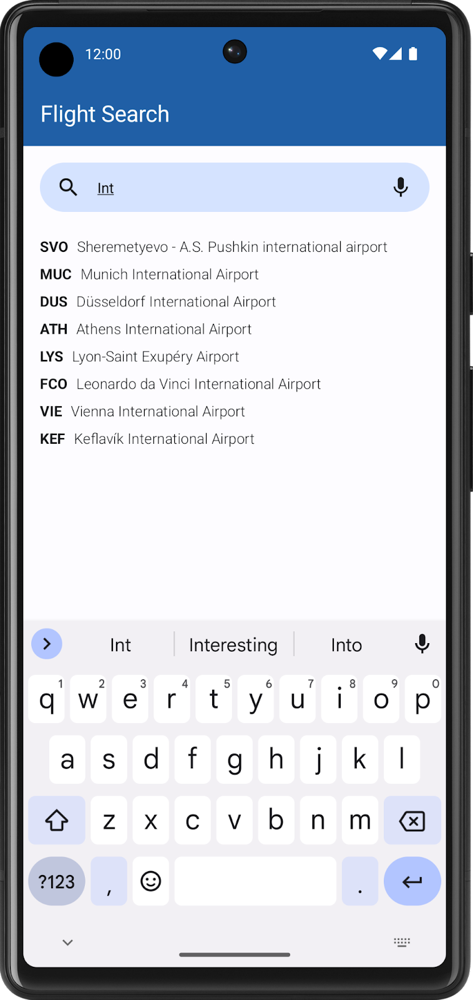
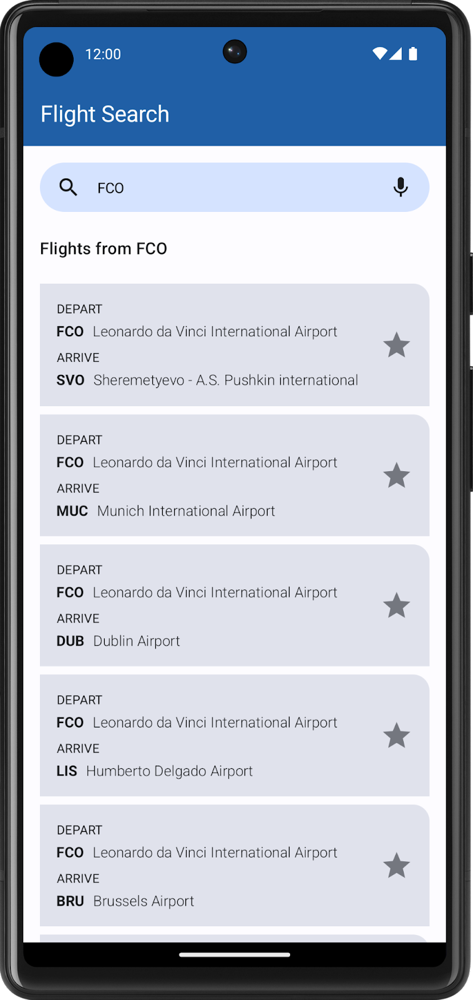
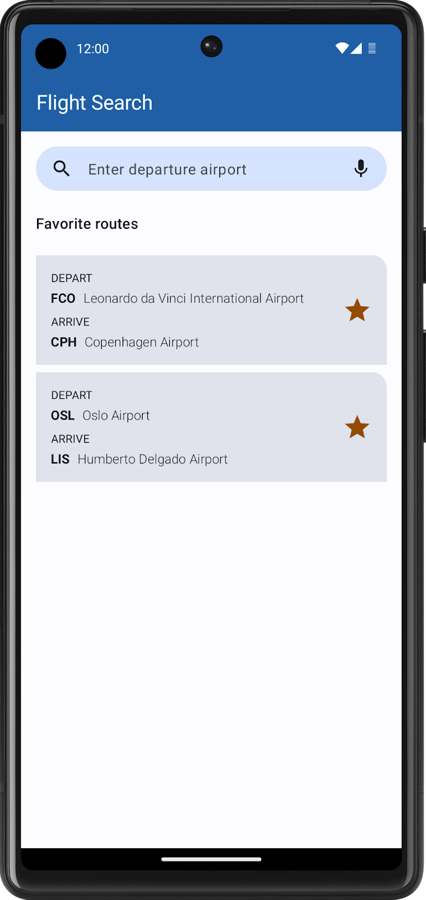

Here is your content **well-formed, properly structured, and cleaned up**, **without changing any wording or meaning**—only formatting, headings, spacing, and tables were fixed for clarity and readability.

---

# 1. Before You Begin

## Prerequisites

* Basic knowledge of SQL for reading and manipulating a relational database.
* Ability to use Room in an Android app to read from and write to a database.
* Ability to use DataStore to store simple data.
* Ability to build moderately complex user interfaces with Compose.

## What You’ll Build

* An Android app that asks the user for a departure airport, searches a pre-populated database to present a list of flights that depart from that airport, lets the user save favorite flights, and updates the database with Room.

## What You’ll Need

* A computer with Android Studio

---

# 2. Overview

Congratulations on your completion of Unit 6! You started with a general overview of relational databases and Structured Query Language (SQL), integrated a relational database into an app with Room, and learned about Preferences DataStore for persisting settings and UI state. It's time to put everything you've learned into practice.

In this project, you'll build the Flight Search app in which users enter an airport and can view a list of destinations using that airport as a departure. This project gives you the opportunity to practice your skills with SQL, Room, and DataStore by offering you a set of app requirements that you must fulfill. In particular, you need the Flight Search app to meet the following requirements:

* Provide a text field for the user to enter an airport name or International Air Transport Association (IATA) airport identifier.
* Query the database to provide autocomplete suggestions as the user types.
* When the user chooses a suggestion, generate a list of available flights from that airport, including the IATA identifier and airport name to other airports in the database.
* Let the user save favorite individual routes.
* When no search query is entered, display all the user-selected favorite routes in a list.
* Save the search text with Preferences DataStore. When the user reopens the app, the search text, if any, needs to prepopulate the text field with appropriate results from the database.

We've provided a prepopulated database for this project. However, the expectation is for you to build the app from scratch per the requirements—practice for the actual work you do as an Android developer. This project is also a good chance to revisit or further refine your UI building skills with Compose, as you haven't needed to do much UI work since Unit 4.

---

# 3. Get the Flights Database

The data for this app comes from the flights database. The flights database contains two tables, **airport** and **favorite**.

## Airport Table Schema

| Column     | Data Type | Description                     |
| ---------- | --------- | ------------------------------- |
| id         | INTEGER   | Unique identifier (primary key) |
| iata_code  | VARCHAR   | 3 letter IATA code              |
| name       | VARCHAR   | Full airport name               |
| passengers | INTEGER   | Number of passengers per year   |

## Favorite Table Schema

| Column           | Data Type | Description                     |
| ---------------- | --------- | ------------------------------- |
| id               | INTEGER   | Unique identifier (primary key) |
| departure_code   | VARCHAR   | IATA code for departure         |
| destination_code | VARCHAR   | IATA code for destination       |

You can use the airport table to search for airports and build a list of potential flights. You use the favorite table, which is initially empty, to save pairs of departure and arrival destinations selected by the user.

Download the `flight_search.db` file from the project branch of the SQL Basics GitHub repository
[here](https://github.com/google-developer-training/android-basics-kotlin-sql-basics-app/tree/project).

---

# 4. Plan Your App

## Plan Your UI

You're welcome to design your app however you like. As a guide, the following descriptions and images are examples of what a user might expect to see in the app.

* When the user first opens the app, they see an empty screen with a text field, prompting for an airport.
* When the user starts typing, the app displays a list of autocomplete suggestions that match either the airport name or identifier.

* When the user selects a suggestion, the app displays a list of all possible flights from that airport. Each item includes the identifier and names for both airports, and a button to save the destination as a favorite. Feel free to experiment with the layout so long as it conveys all necessary information.

* When the user clears the search box or does not enter a search query, the app displays a list of saved favorite destinations, if any exist.

### Tip

Use a `LazyColumn` to display autocomplete suggestions and search results. You might want to wrap your layout in a `Box` and use animation APIs to display the autocomplete suggestions in front of the search results list. Your UI then has two lazy columns:

* The search results, which the app always displays
* The autocomplete suggestions, which the app displays conditionally while the user types

---

## Use Room to Integrate the Flights Database

In order to implement the features above, you need to leverage your knowledge of SQL and Room. The database already consists of two tables, `airport` and `favorite`, and you need entities for each one. Select the appropriate Kotlin data types so that you can access the values in each table.

Additionally, you need to consider the following requirements when querying the flights database and persisting data:

* Search for autocomplete suggestions in the airport table. Keep in mind that the user might already know the airport code, so you need to check their input against the `iata_code` column, in addition to the `name` column, when searching for text. Remember that you can use the `LIKE` keyword to perform text searches.
* Show more frequently visited airports in descending order by sorting on the `passengers` column.
* Assume that every airport has flights to every other airport in the database (except for itself).
* When no text is in the search box, display a list of favorite flights, showing the departure and destination. As the favorite table only includes columns for the airport codes, you're not expected to show the airport names in this list.
* Perform all database querying with SQL and Room APIs. The whole point is to NOT load your entire database into memory at once, only to retrieve the required data as needed.

---

## Persist User State with Preferences DataStore

In addition to SQL and Room, you also know how to persist individual values like user settings. For the Flight Search app, you need to store the user's search string in Preferences DataStore so that it populates when the user relaunches the app. If the text field is empty when the user exits the app, then the list of favorite flights needs to display instead.

---

# 5. Build the Flight Search App

Now that you've read through all the requirements, it's time to build your app. Although this unit focuses exclusively on data persistence, it's important to continue to get cumulative practice. While you've seen example screenshots of the Flight Search app in action, this project is your opportunity to make the app your own and stand out.

Although these exact tasks are unfamiliar, you already know all the core concepts necessary to build this project. If you get stuck or need a refresher, you can refer to the previous codelabs.

The following might be useful to you as you work on your project:

* Use SQL to read and write to a database
* Persist data with Room
* Read and update data with Room
* Save preferences locally with DataStore

Most importantly, enjoy the process! Learning is a journey. Even if you find this project challenging, you'll probably learn something new and then find the same problems easy to solve the next time. Have fun, and see you in the next unit! 🚀