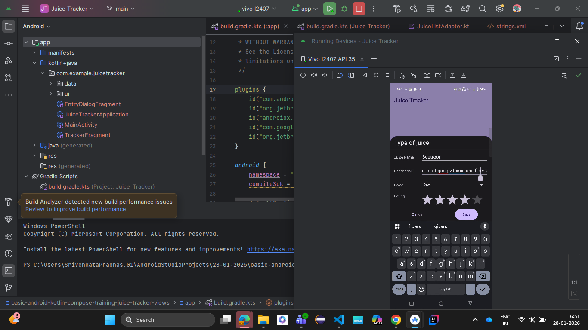
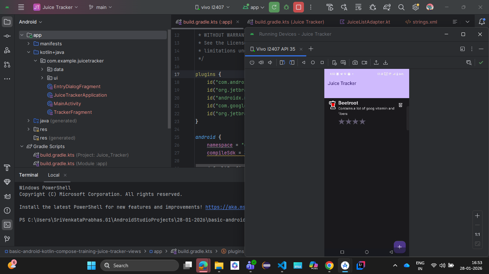
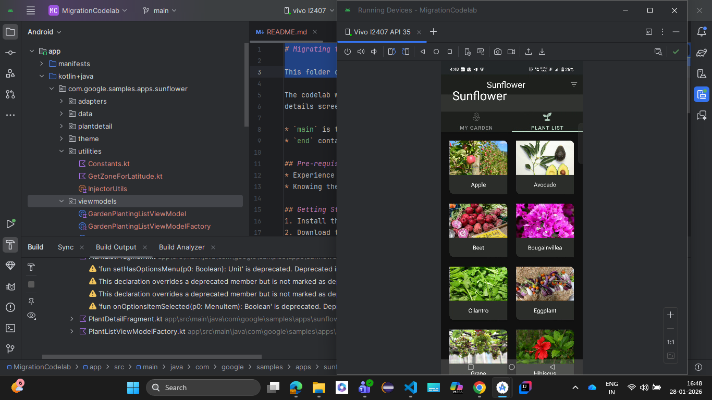
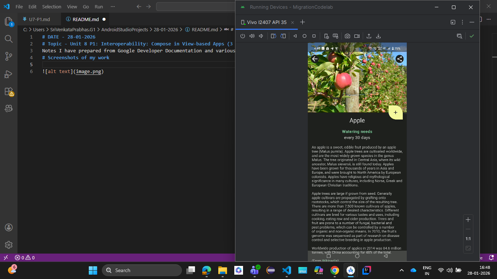
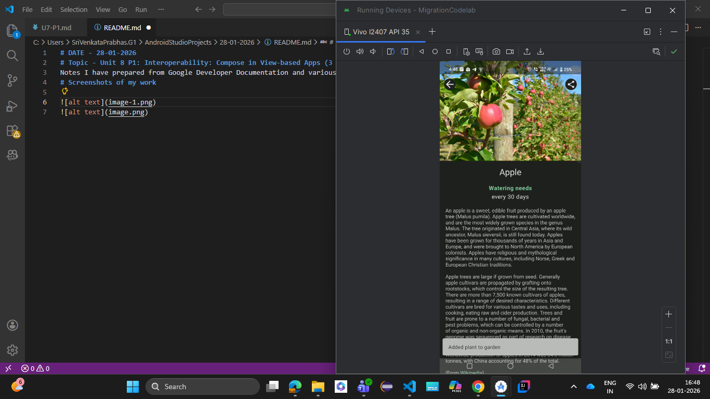
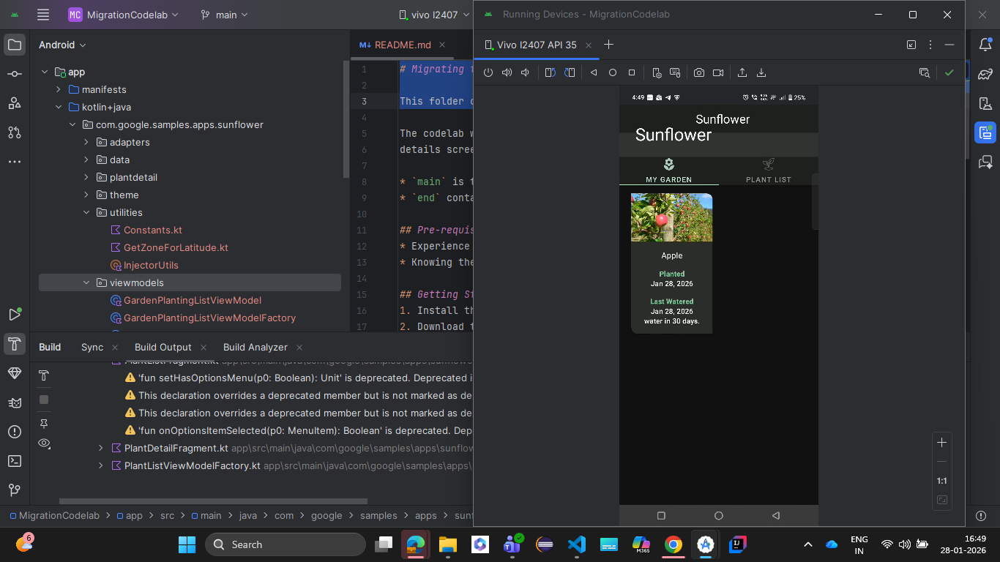

# DATE - 28-01-2026
# Topic - Unit 8 P1: Interoperability: Compose in View-based Apps (3 hrs total)
Notes I have prepared from Google Developer Documentation and various sources
# Screenshots of my work
- Juice Tracker

- Sunflower(MigrationCodeLab)

